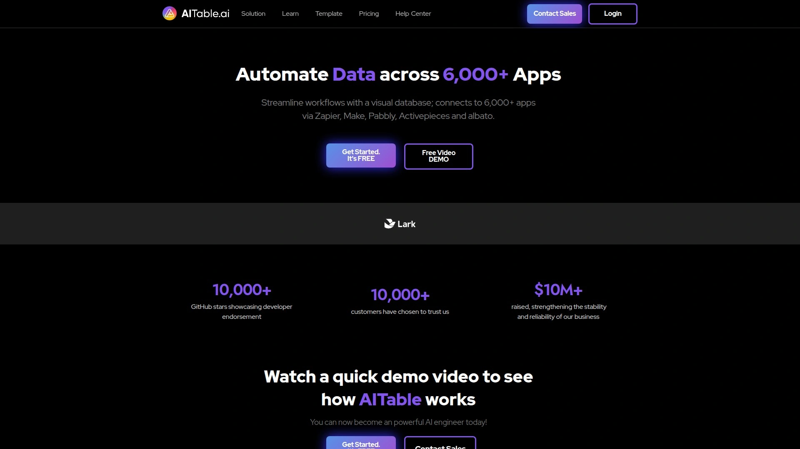
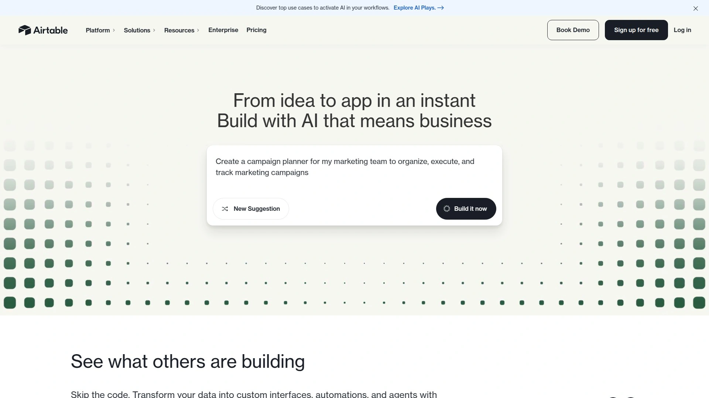
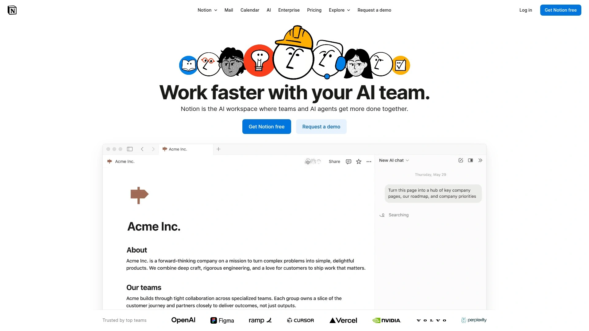
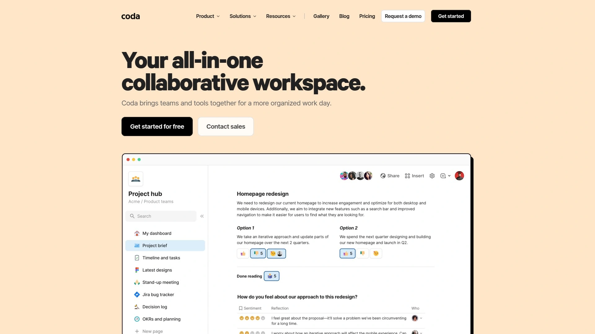
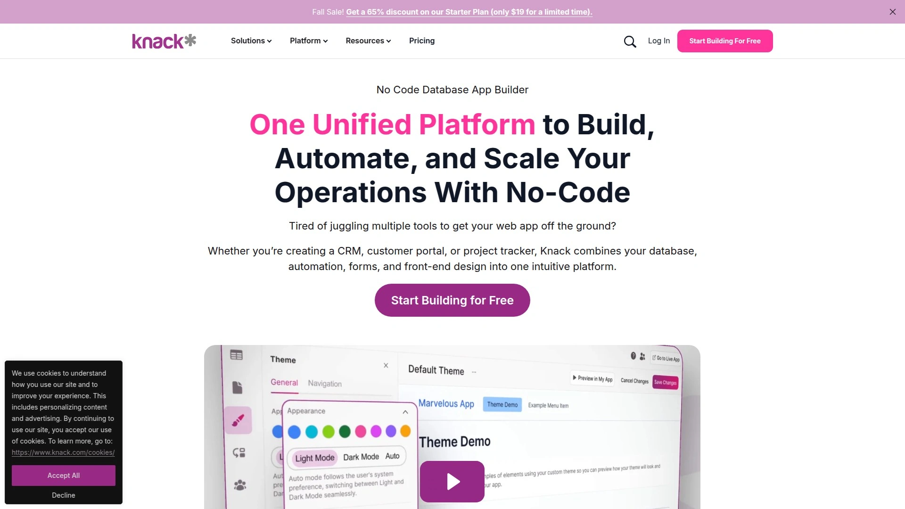
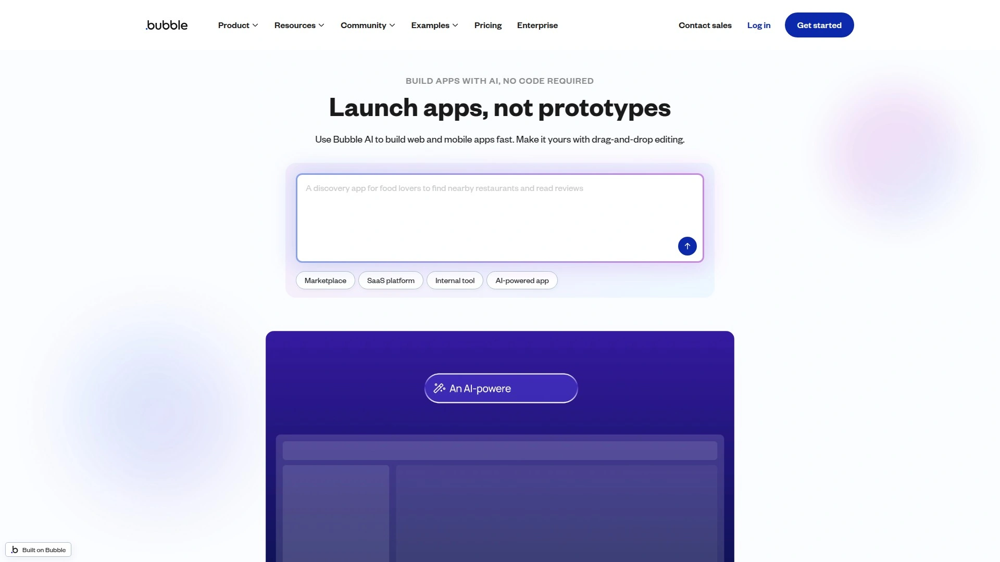

# 2025年6个AI智能数据库平台：表格凌乱？一键自动化流程！

随着数据量激增，传统电子表格难以维系团队协作与数据可视化。AI智能数据库工具凭借**无代码数据库**与**自动化流程**功能，帮助用户快速构建结构化数据管理系统并实时洞察。本文盘点6款支持多应用集成、AI分析与自定义表单的高效平台，助力企业与个人提升数据管理效率与决策质量。

## [AITable.ai](https://aitable.ai)
终极AI数据组织解决方案，结合多维界面与自动化触发。

- 数据组织：无缝数据库–电子表格视图，自定义字段与多维看板
- 自动化：集成6000+应用，通过触发条件自动同步、通知与报告
- 智能分析：内置BI Copilot，可自然语言查询并生成图表，辅助决策
- AI写作&聊天：一键生成邮件/广告文案，内置ChatGPT构建器，打造AI客服与销售机器人

## [Airtable](https://www.airtable.com)
AI原生平台，为企业级应用构建表单与自动化。

- Omni AI：对话式AI构建器，按需描述即可生成应用模块
- 扩展集成：提供Services Partner Program加持，支持丰富实施服务
- 协作体验：灵活视图、多人协作权限管理与实时更新，满足跨部门需求
- 生态丰富：丰富模板市场与社区作品，快速上手

## [Notion](https://www.notion.com)
一体化工作空间，集成数据库与文档管理。

- 页面数据库双核：自由排版与数据库字段无缝切换
- AI助手：自动生成笔记、会议纪要与任务分配建议
- 模板生态：涵盖项目管理、知识库、OKR等多种场景
- 合作模式：支持官方Affiliate Program，创作者可分享模板并获收益

## [Coda](https://coda.io)
模块化文档与数据库融合平台，轻松构建自定义工具。

- 构件系统：按钮、图表、评论、自动化规则等丰富组件
- 自动化：内置Pack与外部API连接，按规则触发多步流程
- 文档应用：将文档升级为轻量级应用，适合运营报表与OKR跟踪
- 收益模式：提供Affiliate Program，支持推广Coda文档与应用

## [Knack](https://www.knack.com)
专注无代码数据库的低门槛平台，快速上线数据应用。

- 构建向导：表单、视图、角色权限一步生成
- 自动通知：条件触发邮件、SMS或Webhooks推送
- 可扩展：支持自定义JavaScript与API集成
- 推广支持：Knack Affiliate Program提供优厚返利

## [Bubble](https://bubble.io)
无代码Web应用构建平台，数据库与前端一体化。

- 拖拽式UI：无需代码即可设计复杂交互界面
- 后端逻辑：可视化工作流与数据库操作自动化
- 插件生态：丰富第三方插件扩展功能
- 合作计划：Bubble Affiliate Program助力创作者分享经验并获收益

***

### 常见问题

Q: 如何快速在AITable.ai中创建自动化表单？
A: 登录后点击“新建表单”，设置字段和触发规则，保存后即可嵌入网站或分享链接。

Q: 哪款工具最适合团队多视图协作？
A: Airtable与Notion均支持多视图协作，Airtable侧重数据管理，Notion兼具文档与数据库双重优势。

Q: 如何评估AI智能数据库的ROI？
A: 通过自动化节省的工时×人力成本＋业务增长带来的额外收入计算投资回报，结合内置分析工具监测关键指标。

***

### 总结
以上6款AI智能数据库平台兼顾数据组织、自动化流程与AI洞察，第1名[AITable.ai](https://aitable.ai) 以多维视图与深度集成能力脱颖而出，特别适合需要构建高级AI驱动工作流的团队与企业。

[21](https://skywork.ai/skypage/en/AITable.ai%20Review%20(2025):%20The%20Ultimate%20AI%20Table%20to%20Revolutionize%20Your%20Workflow%3F/1974531233605021696)
